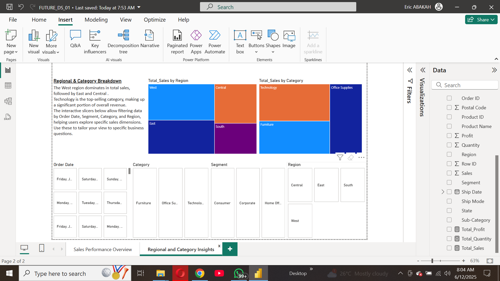

# FUTURE_DS_01
Task 1 for the Data Science &amp; Analytics Internship at Future Interns

# E-commerce Sales Dashboard – Power BI Project

## Project Overview

This Power BI dashboard was developed to analyze e-commerce data and uncover key business insights. The goal was to identify best-selling products, sales trends, and high-revenue categories that can support data-driven decision-making.

## Dataset

The dataset, **Sample - Superstore**, contains information on orders, sales, profits, customers, regions, and product categories.

## Key Insights

- **Total Sales:** $2.30M
- **Top-Selling Product:** Canon ImageCLASS 2200 Advanced Copier
- **Best Performing Category:** Technology
- **Peak Sales Month:** November
- **Region with Highest Sales:** West

## Skills & Tools Used

- **Power BI**: for dashboard creation
- **DAX**: to calculate Total Sales and Profit measures
- **Data Modeling**: relationships between tables
- **Slicers**: for interactive filtering (e.g., by Region, Category, Segment)
- **Visualizations**: bar charts, line graphs, tree maps, and KPIs

## Dashboard Pages

1. **Sales Overview**
   - KPIs: Total Sales
   - Top-selling products bar chart
   - Monthly trend line
   - Regional/category comparison

2. **Sales Breakdown**
   - Tree maps for Region and Category
   - Slicers for Order Date, Category, Segment, and Region

## What I Learned

- Creating dynamic dashboards with filters and drill-down capability
- Using DAX for custom calculations
- Applying business storytelling techniques to highlight trends and performance

## Preview

## Dashboard Preview

### Page 1: Sales Overview

### Page 2: Regional & Category Insights

*(Insert screenshots or link to Power BI report if published)*

## How to Use

Download the `.pbix` file and open it with Power BI Desktop to interact with the dashboard and explore the data further.

